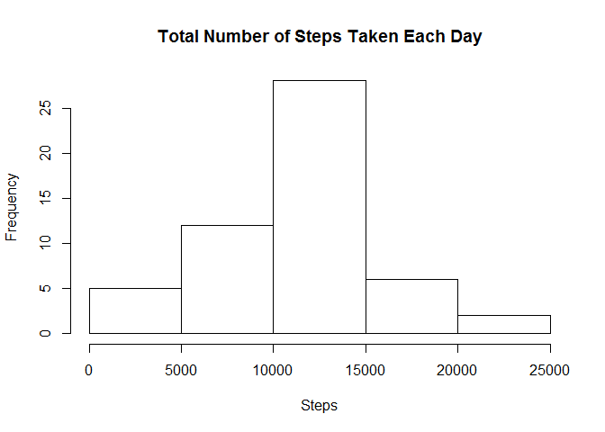
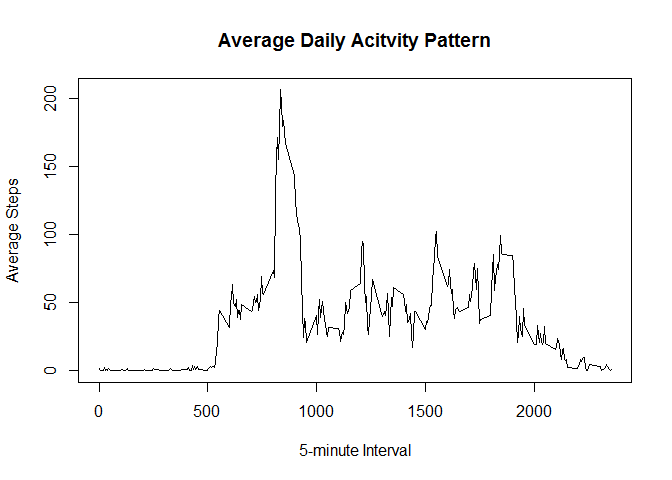

# Reproducible Research: Peer Assessment 1


## Loading and preprocessing the data

Read in the data 

The dataset table names are:
- Steps: Number of steps taking in a 5-minute interval (missing values are coded as NA)
- Date: The date on which the measurement was taken in YYYY-MM-DD format
- Intervals:  Identifier for the 5-minute interval in which measurement was taken


```r
dat <-read.csv("activity.csv")
```

## What is mean total number of steps taken per day?

Make an aggregate dataset showing the number of steps taken per day:

```r
## find the total steps per day 
## aggregate data by date and add up the steps for each day
aggbyDate <- aggregate(steps ~ date, dat, FUN = sum)
```

Make a histogram of the total number of steps taken each day

```r
## make the histogram
hist(aggbyDate$steps, main = "Total Number of Steps Taken Each Day", xlab = "Steps", ylab = "Frequency")
```



Calculate and report the mean and median of the total number of steps taken per day

```r
## find mean and Median using the mean and median functions
meanData <- mean(aggbyDate$steps) 
medData <- median(aggbyDate$steps)
```

The mean of this dataset is **10766.19 Steps**
The median of this dataset is **10765 Steps**

## What is the average daily activity pattern?

Make a time series plot (i.e. type = "l") of the 5-minute interval (x-axis) and the average number of steps taken, averaged across all days (y-axis)


```r
##similar to what was done above aggregate the steps by interval and average that for each day
aggbyInterval <- aggregate(steps ~ interval, dat, FUN = mean)

#make the time series plot of the Average Daily Acitivty Pattern
plot(aggbyInterval$interval, aggbyInterval$steps, type = "l", xlab = "5-minute Interval", ylab = "Average Steps", main = "Average Daily Acitvity Pattern")
```



Find the 5-minute interval, on average across all the days in the dataset, that contains the maximum number of steps

```r
#Use the which.max function to find which interval has the max number of steps
maxInt <-  aggbyInterval[which.max(aggbyInterval$steps), ]$interval
```

The 5-minute interval that has the max number of steps is the **835th Interval** 

## Imputing missing values


Calculate and report the total number of missing values in the dataset (i.e. the total number of rows with NAs)


```r
## sum of the total number of NAs in the dataset 
countNAs <- sum(is.na(dat))
```
There are **2304 missing values** in the data set

Devise a strategy for filling in all of the missing values in the dataset. The strategy does not need to be sophisticated. For example, you could use the mean/median for that day, or the mean for that 5-minute interval, etc. Also, Create a new dataset that is equal to the original dataset but with the missing data filled in.

**I am going to use the mean for that particular day to fill in the missing values**


Make a histogram of the total number of steps taken each day and Calculate and report the mean and median total number of steps taken per day. Do these values differ from the estimates from the first part of the assignment? What is the impact of imputing missing data on the estimates of the total daily number of steps?


## Are there differences in activity patterns between weekdays and weekends?
